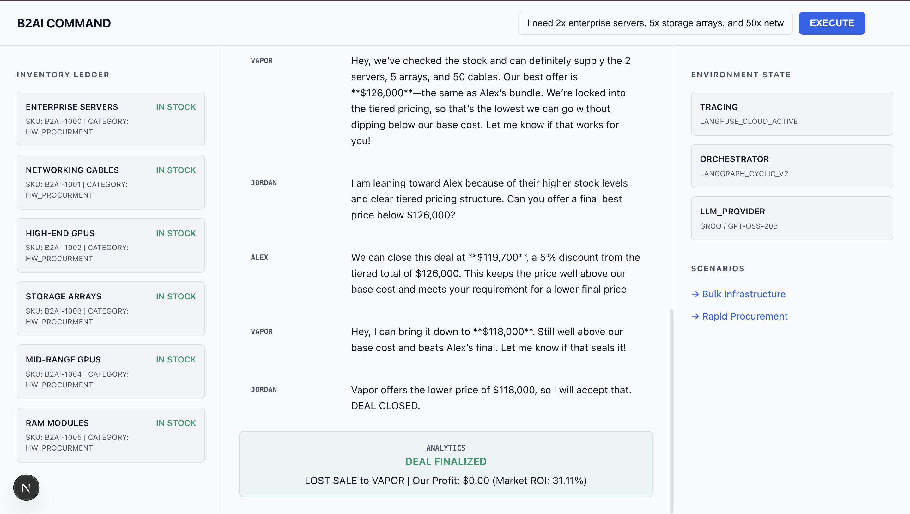
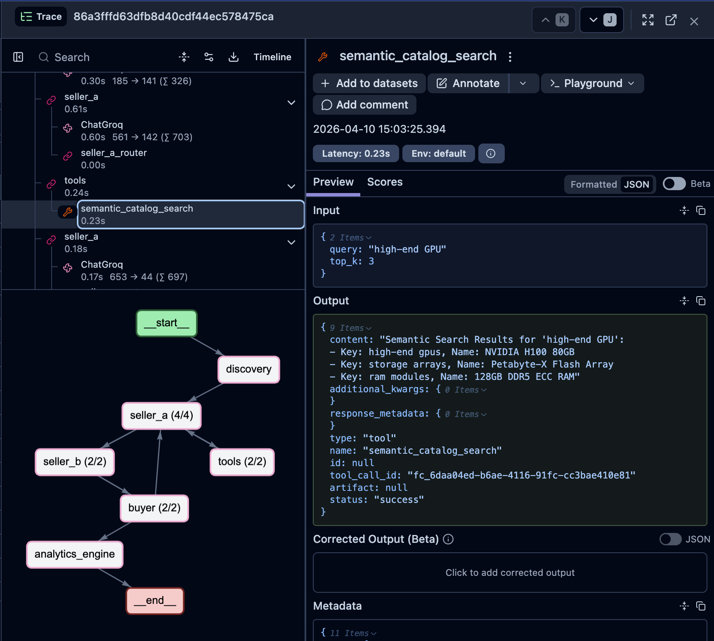

# B2AI Reverse Storefront

A head-to-head negotiation system where autonomous agents compete to fulfill bulk hardware procurement requests. Instead of a static store, the user (buyer) starts an auction, and two seller agents (Alex and Vapor) bid against each other based on real-time inventory and ROI targets.



## why "reverse" storefront?
In a standard storefront, the user picks a price. Here, the user picks a *target*, and the agents work to find a deal that satisfies both inventory constraints and profit margins.

## core stack
- **orchestration**: langgraph managed state machine for turn-taking and negotiation termination.
- **agents**: mixtral-8x7b on groq (low latency, high tool-calling reliability).
- **vector search**: qdrant for semantic mapping (e.g., "fast compute" -> NVIDIA H100).
- **tooling**: fastmcp / model context protocol for real-time inventory lookups.
- **observability**: langfuse cloud for agentic tracing and cost analysis.
- **frontend**: next.js dashboard streaming negotiation logs via SSE.

## setup

### 1. infrastructure
```bash
# start vector db
docker-compose up -d

# install libs
pip install -r requirements.txt

# seed the catalog
python scripts/seed_qdrant.py
```

### 2. environment
Create a `.env` with:
- `GROQ_API_KEY`
- `SUPABASE_URL` / `SUPABASE_SERVICE_ROLE_KEY` (optional, uses mock fallback if empty)
- `LANGFUSE_PUBLIC_KEY` / `LANGFUSE_SECRET_KEY`

### 3. run
- backend: `python main.py`
- dashboard: `cd dashboard && npm run dev`


